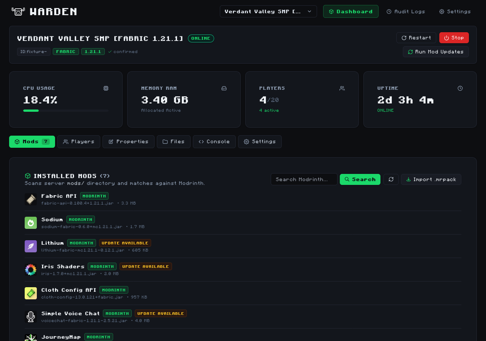
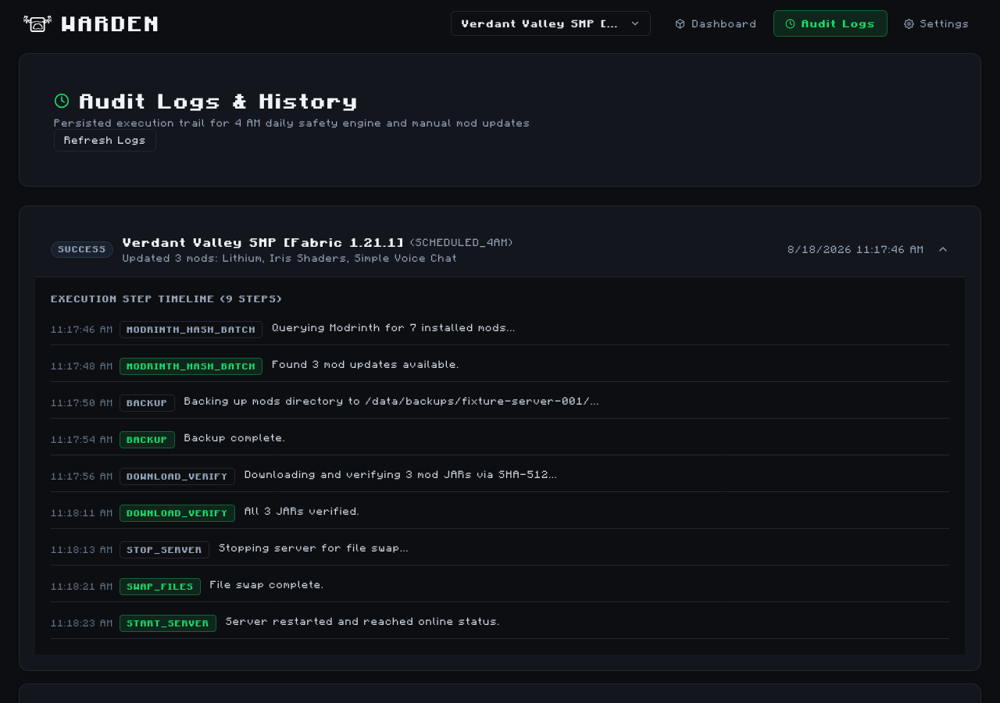
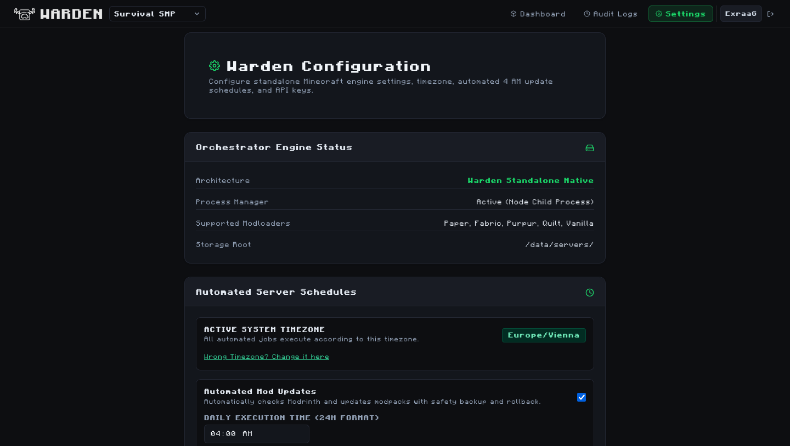

<p align="center">
  
</p>

<p align="center">
  <b>Modern Minecraft Companion Dashboard & Automation Engine</b><br />
  <i>Lightweight, responsive management web app for Crafty Controller with 1-click Modrinth & .mrpack updates.</i>
</p>

<p align="center">
  
  
  
  
  
  
</p>


## Screenshots

**Dashboard — Server Overview with live stats and mods overview**



**Audit Logs — Step-by-step 4 AM update execution trail**



**Settings — Crafty API configuration and Warden API key management**




## Key Features

- **Flat Dark Ops-Tool Aesthetic**: Built with dark slate theme, Industrial Safety Amber (`#f59e0b`) accent, Tabler icons, crisp custom UI components, and **zero gradients**.
- **Top-Left Server Switcher Dropdown**: Fast switching across all Crafty-managed Minecraft servers.
- **Crafty Controller API v2 Integration**:
  - Automatically fetches and validates Crafty's OpenAPI schema on startup (`/api/v2/openapi.json`), caching extracted field names.
  - Controls server actions (Start, Stop, Restart) and file operations with path sanitization and 15s request timeouts.
- **Modrinth v2 API Integration**:
  - Searches and installs mods with automatic loader (Fabric/Forge/NeoForge/Quilt/Paper) and Minecraft version filtering.
  - Resolves required dependencies recursively before uploading files to Crafty.
  - Verifies SHA-512 checksums of downloaded mod `.jar` files prior to deployment.
- **4 AM Safety Engine**:
  - Batch queries Modrinth via `POST /v2/version_files/update` using local SHA-512 hashes to respect rate limits.
  - Pre-update safety backups of current server `mods` directory.
  - File swap & directory verification.
  - **Automatic Rollback**: If server fails to reach `online` status or crashes after updates, automatically restores pre-update backup and restarts the server safely.
- **Loader & Version Priority Detection**:
  - 4-step detection: (1) Operator manual override in DB, (2) Configured executable filename, (3) Root library/properties files, (4) Mod metadata.
  - Flags unconfirmed or conflicting servers for human confirmation before enabling 4 AM updates.
- **Single Docker Container Deployment**:
  - Exposes Express API + Next.js frontend in a single unit mounting a persistent `./data:/data` volume.


## Repo Structure

```
Warden/
├── docker-compose.yml       # Production Compose configuration
├── .env.example             # Environment variable template
├── shared/                  # @warden/shared API types and contracts
│   ├── package.json
│   ├── tsconfig.json
│   └── src/
│       ├── index.ts
│       └── types.ts
└── server/                  # Node.js/Express API + Next.js web application
    ├── Dockerfile           # Multi-stage container runner with healthcheck
    ├── package.json
    ├── tsconfig.json
    ├── tsconfig.server.json
    └── src/
        ├── server.ts        # Express server entry point
        ├── config.ts        # Environment & config loader
        ├── adapters/
        │   ├── crafty.ts    # Schema-validated Crafty v2 client
        │   └── modrinth.ts  # Modrinth v2 client & dependency resolver
        ├── db/
        │   └── storage.ts   # Persistent JSON storage in /data
        ├── detection/
        │   └── loader.ts    # 4-step loader & MC version detector
        ├── jobs/
        │   └── cron.ts      # 4 AM safety update cron runner
        ├── routes/
        │   └── api.ts       # Express REST API routes (/api/v1/*)
        ├── components/ui/   # Custom flat component layer (Button, Card, Badge, Dropdown, Table, Modal)
        └── app/             # Next.js web views (Dashboard, Mods, Audit Logs, Settings)
```


## Quick Start (Docker Deployment)

### 1. Clone Repository & Setup Environment

```bash
# Clone the repository
git clone https://github.com/ExraaG/Warden.git
cd Warden

# Copy the environment file template
cp .env.example .env

# Edit configuration with your Crafty Controller URL & API key
nano .env
```

#### How to Get Your Crafty API Key:
1. Open your **Crafty Controller** panel in your browser.
2. Click your **Profile avatar/name** in the top right corner.
3. Click **Account Settings**.
4. Go to the **API Keys** tab.
5. Click **Create Key** / **New API Key**.
6. Check the **Full Access** checkbox (required for server controls, console, and mod uploads).
7. Click **Generate / Save**, then click **Get Token** and copy the full token string.
8. Paste the copied token into your `.env` (`CRAFTY_API_KEY=...`) or configure it directly in Warden's **Settings** page (`/settings`).

Example `.env`:
```env
CRAFTY_URL=https://your-crafty-ip:8443
CRAFTY_API_KEY=your_long_lived_crafty_api_bearer_token
WARDEN_API_KEY=my_secure_warden_key
PORT=3000
TZ=America/New_York
```

### 2. Deploy Container

Run Docker Compose to build and start Warden in the background:

```bash
docker compose up -d --build
```

- Access the Warden dashboard at `http://<YOUR-SERVER-IP>:3000`
- View live application logs: `docker compose logs -f`
- Stop the container: `docker compose down`


## Operational Tasks

### Confirming a Server's Loader & MC Version
If a server has conflicting or missing loader metadata, Warden flags it with a **Human Operator Confirmation Required** banner.
1. Open the Warden Dashboard for the server.
2. Click **CONFIRM LOADER & VERSION**.
3. Select the correct modloader (Fabric, Forge, NeoForge, Quilt, Paper, Vanilla) and Minecraft version (e.g. `1.21.1`).
4. Click **SAVE CONFIRMATION**. The server is now enabled for automated 4 AM updates.

### Monitoring & Triggering Update Jobs
- **Scheduled 4 AM Job**: Runs automatically at 4:00 AM in your configured `TZ` timezone.
- **Manual Trigger**: Click **UPDATE NOW** on the Dashboard or send `POST /api/v1/servers/:id/update-now`.
- **View Step Execution & Rollback History**: Navigate to the **AUDIT LOGS** tab to view step-by-step execution logs (`modrinth_hash_batch`, `download_verify`, `backup`, `stop_server`, `swap_files`, `verify_directory`, `start_server`, `rollback_action`).


## Disclaimer & Attribution

Portions of this codebase and architecture were built and accelerated with the assistance of AI development tools. All code has been structured, reviewed, and tested for performance, reliability, and security.
